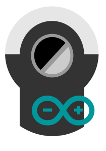

# Sommer Pro+ Garage Door Control

This ESP8266-based controller allows to remotely steer the [Sommer Pro+](https://www.sommer.eu/de/sommer-pro-plus.html) Garage door control.

It connects to an MQTT broker and listens on one topic `<device-name>/command` to steer the garage door and updates it state in real-time at `<device-name>/isClosed`. In my case I use [IOBroker MQTT adapter](https://github.com/ioBroker/ioBroker.mqtt) in server mode as broker, but it also works with Mosquito and such.

**Use at your own risk!**

Things needed to run this:
- A Sommer Garage Door Pro+ Control (looks similar to the icon at the top)
- Sommer Conex (S10807-00001)
- Sommer Relay (7042V000)
- the assembled [board](board/README.md) and all parts listed for it
- some spare electrical wires to connect everything
- A MQTT-broker installed somewhere in your network which the board can connect to.

_It might work for different components as well, but this resembles roughly my setup._

## Installation
1. Micropython firmware needs to be flashed to the esp8266-board first. Can be done with `esptool` or _uPyCraft_ editor (or similar).
    - **This code requires to python libs ([mqtt_as.py](https://github.com/peterhinch/micropython-mqtt/blob/master/mqtt_as/mqtt_as.py) & [sdcard.py](https://github.com/micropython/micropython-lib/blob/master/micropython/drivers/storage/sdcard/sdcard.py)) to be frozen into the firmware as the board has not enough RAM to compile it during runtime, so installing just the esp8266 port of micropython won't work**
    - Options:
        1. Include the two libs in the [modules folder](https://github.com/micropython/micropython/tree/master/ports/esp8266/modules) of the MicroPython ESP8266 port and build it yourself. Getting the build to succeed might take some work though Flash the `firmware.bin`.
        2. Take a [firmware I built for myself](mpy-firmware/firmware.bin) and flash it to your device **at your own risk**! (based on [v1.22.2](https://github.com/micropython/micropython/releases/tag/v1.22.2))
2. The files from the `src` folder need to be copied to your board. This can be done easily via editors like _UPyCraft_ or CLI tools like [ampy](https://github.com/scientifichackers/ampy). Be sure to rename `config.json.tmpl` to `config.json` and setup your config credentials correctly.

## MQTT broker topics
| Topic | Values | Description |
|-------|--------|-------------|
|`<device-name>/command`| `open`, `close` | Trigger the door to open/close. |
|`<device-name>/isClosed` | `true`, `false` | Current status of the door. |
|`<device-name>/lastUpdate` | | Timestamp when door status was last checked |

## Board
Please refer to the [board design description](board/README.md) for more information about the board. This repo contains all files required to print/assemble it yourself.

## Alternatives
- Sommer in their online document-library provide a set of instructions on how to connect the garage door control to Somfy's Tahoma box: https://downloads.sommer.eu/files/Anbindung-base+pro+anSomfyTahomaBoxRaccordementdebase+pro+laSomfyTahomaBox_S12360-00000.pdf. However there are (from my perspective) some issues with it.
  - Somfy GU Controller io Art. No. 1841211 is required, which is a) very expensive and b) hardly available, as apparently Somfy stopped manifacturing it (for unknown reason)
  - You also need the Somfy Tahoma box ($$$) to make any use of it
- There is a custom-built solution based on Arduino described/sold here: https://arduino-projekte.info/homekit-garagentor-und-drehtoroeffner-eps8266-arduino-hoermann-sommer-antriebe/
  - Although quite cool, it offers no integration with Sommer Relay (Art. 7042V000), only with Sommer Connex (Art. S10807-00001), meaning you can steer the garage door, but will not know if it actually is opened or closed.
  - Software-wise it integrates directly with Homekit (Apple Smarthome), making it unusable for my smarthome setup.