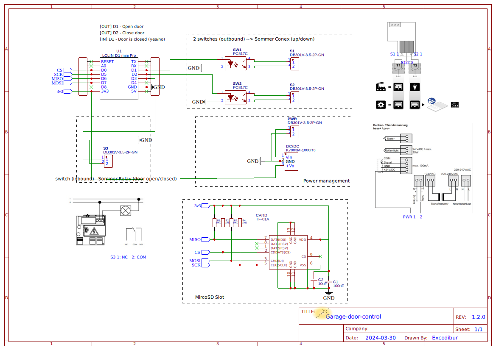
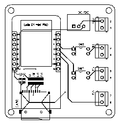
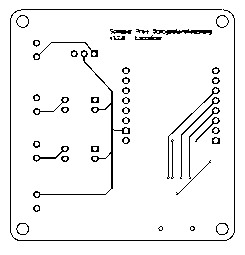
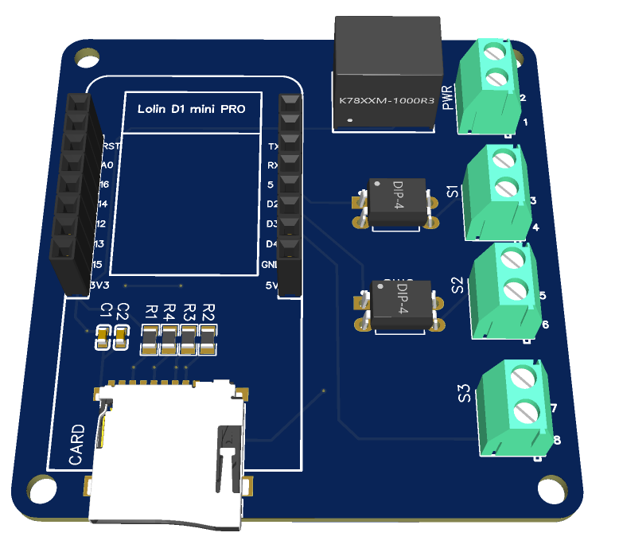
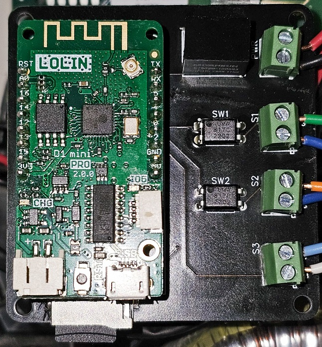

# Board design
# Wire plan

# Parts list
| ID | Name | Designator | Footprint | Quantity | Manufacturer | Part	Manufacturer | Supplier | Supplier Part | Price |
|----|-----|-|-|-|-|-|-|-|-|
| 0 | LOLIN D1 mini Pro | U1 | LOLIN D1 MINI PRO | 1 | Wemos | LOLIN | AliExpress | D1_mini_Pro | |
| 1 | 100nF | C1 | C0603 | 1 | 0603B104K500NT | FH | LCSC | [C30926](https://www.lcsc.com/product-detail/Multilayer-Ceramic-Capacitors-MLCC-SMD-SMT_FH-Guangdong-Fenghua-Advanced-Tech-0603B104K500NT_C30926.html) | 0.002 |
| 2 | 10uF | C2 | C0603 | 1 | CL10A106KP8NNNC | SAMSUNG | LCSC | [C19702](https://www.lcsc.com/product-detail/Multilayer-Ceramic-Capacitors-MLCC-SMD-SMT_Samsung-Electro-Mechanics-CL10A106KP8NNNC_C19702.html) | 0.005 |
| 3 | TF-01A | CARD | TF-SMD_TF-01A | 1 | TF-01A | 韩国韩荣 | LCSC | [C91145](https://www.lcsc.com/product-detail/SD-Card-Connectors_Korean-Hroparts-Elec-TF-01A_C91145.html) | 0.161 |
| 4 | K7803M-1000R3 | DC/DC | PWRM-TH_K78XXM-1000R3 | 1 | K7803M-1000R3 | MORNSUN | LCSC | [C132363](https://www.lcsc.com/product-detail/Power-Modules_MORNSUN-Guangzhou-S-T-K7803M-1000R3_C132363.html) | 3.053 |
| 5 | Header-Female-2.54_1x8 | P1,P2 | HDR-TH_8P-P2.54-V-F-1 | 2 | Female headerHDR1X8-2.54 | BOOMELE | LCSC | [C27438](https://www.lcsc.com/product-detail/Female-Headers_BOOMELE-Boom-Precision-Elec-2-54-1-8P_C27438.html) | 0.069 |
| 6 | DB301V-3.5-2P-GN | PWR,S1,S2,S3 | CONN-TH_DB301V-3.5-2P-GN | 4 | DB301V-3.5-2P-GN | DIBO | LCSC | [C695629](https://www.lcsc.com/product-detail/Screw-terminal_DORABO-DB301V-3-5-2P-GN-S_C695629.html) | 0.095 |
| 7 | 10kΩ | R1,R2,R3,R4 | R0805 | 4 | 0805W8J0103T5E |	UNI-ROYAL | LCSC | [C25612](https://www.lcsc.com/product-detail/Chip-Resistor-Surface-Mount_UNI-ROYAL-Uniroyal-Elec-0805W8J0103T5E_C25612.html) | 0.001 |
| 8 | PC817C | SW1,SW2 | DIP-4_L4.6-W6.5-P2.54-LS7.6-BL | 2 | PC817C | Wuxi China Resources Huajing Microelectronics | LCSC | [C115500](https://www.lcsc.com/product-detail/Optocouplers-Phototransistor-Output_Wuxi-China-Resources-Huajing-Microelectronics-PC817C_C115500.html) | 0.056 |
# 2D
|  |  |
|:--:|:--:|
| Top view | Bottom view |

# 3D

# Gerber file
This can be used to order the PCB yourself. I ordered mine at [JLCPCB](http://jlcpcb.com), but it should work with most manufacturers.

[PCB Gerber file](gerber.zip)

# Assembled & Installed
